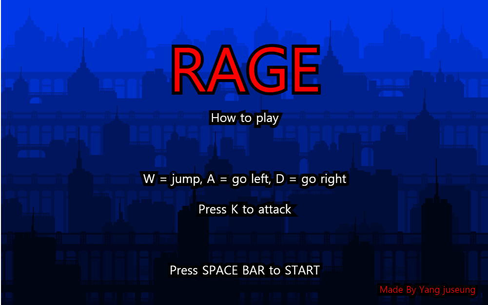
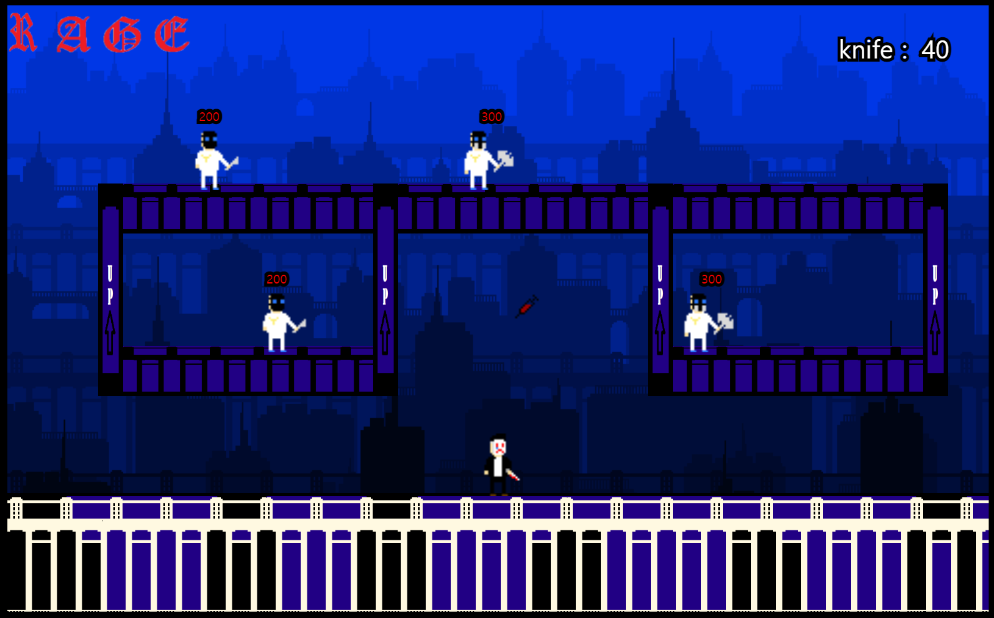
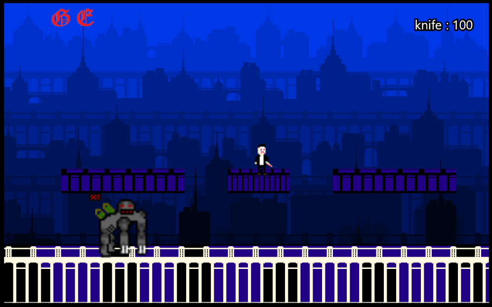

// Name       : Yang juseung
// Assignment : Final project
// Course     : CS099
// Spring 2021

-theme

- Escape the unknown lab and revenge to the scientists who did a medical experiment to main character
- 2D action platform game

-setting
I setted show the image and play back ground sound. Also I made function call Mobs and drug, life, etc.

- main scene

it described how to move and how to fight
- cut scene1

story number1
- cut scene2

story number2
- cut scene3

story number3
-level1 

as you can see there is health as "RAGE" and also there is MOBS and platforms. And if you kill all of those MOB's you can 
-level2

as you can see there is a Boss and platforms. If you kill the Boss you can see the ending
- cut scene4

story number4

-scenario
The man who walk on the street met the monster at the alley. The monster attacked the man and he passed out. And then one strange scientists came toward the man and take him to the unknown lab. The man got the medical experiment. When he woke up at the tube filled with strange liquid he felt pain and strong strength because of medical experiment. He put the mask on which is on the desk and picked up the knifes and killed all the scientists. When he finally killed the monster he felt a bit released. But the man didn't know some one was watching him.

main character

 : Anyone doesn't know his name. All we know is he was attacked by the experiment number-2069. He kills the scientists and experiment number-2069 for the other people.

scientists 

: They work at the Aether Foundation. They study for the eternal life and power of human strength.

BOSS

: Experiment number-2069. He likes to attack someone and it is full of rage.
-mechanic

-I made a gravity and collisions to make a platform and hit box between user and Mobs